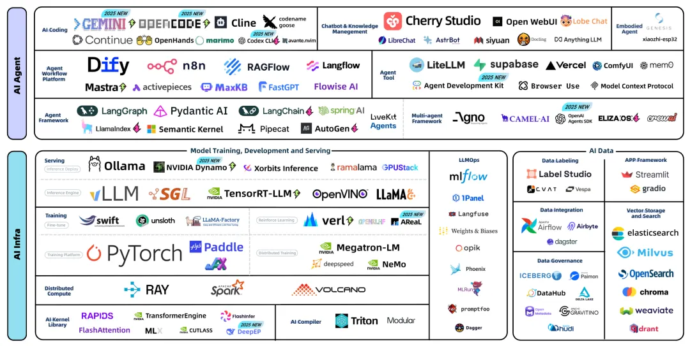
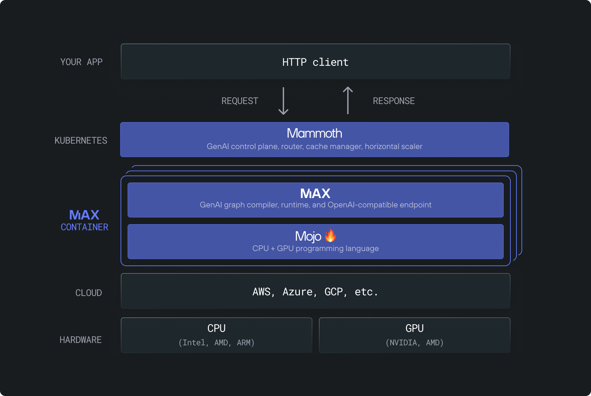
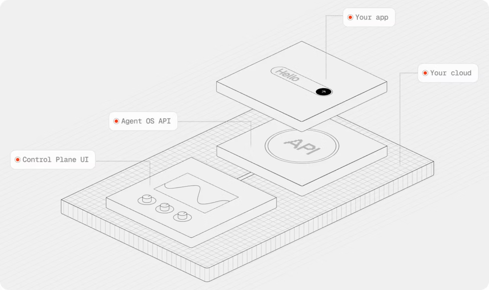
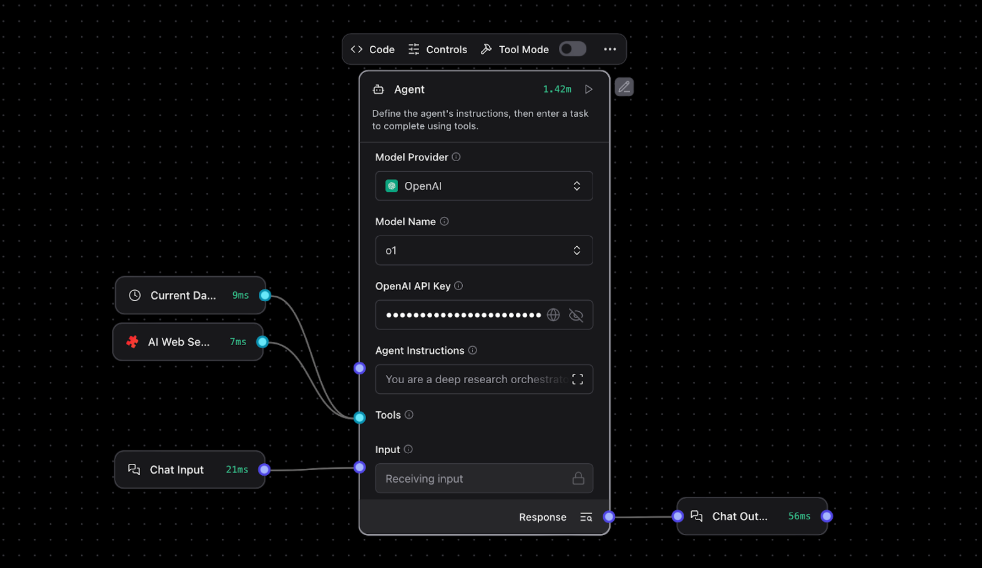
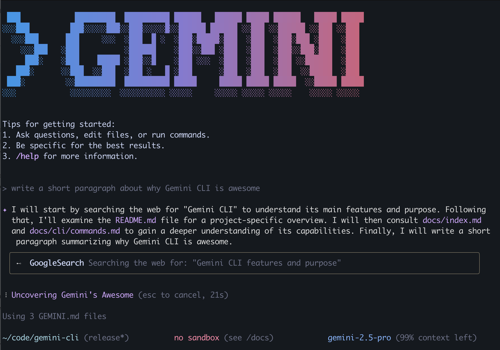
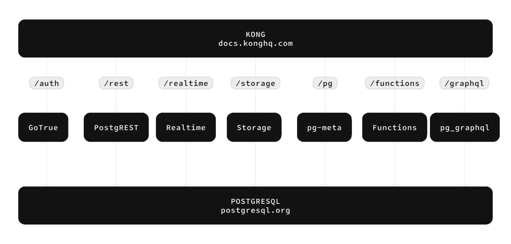
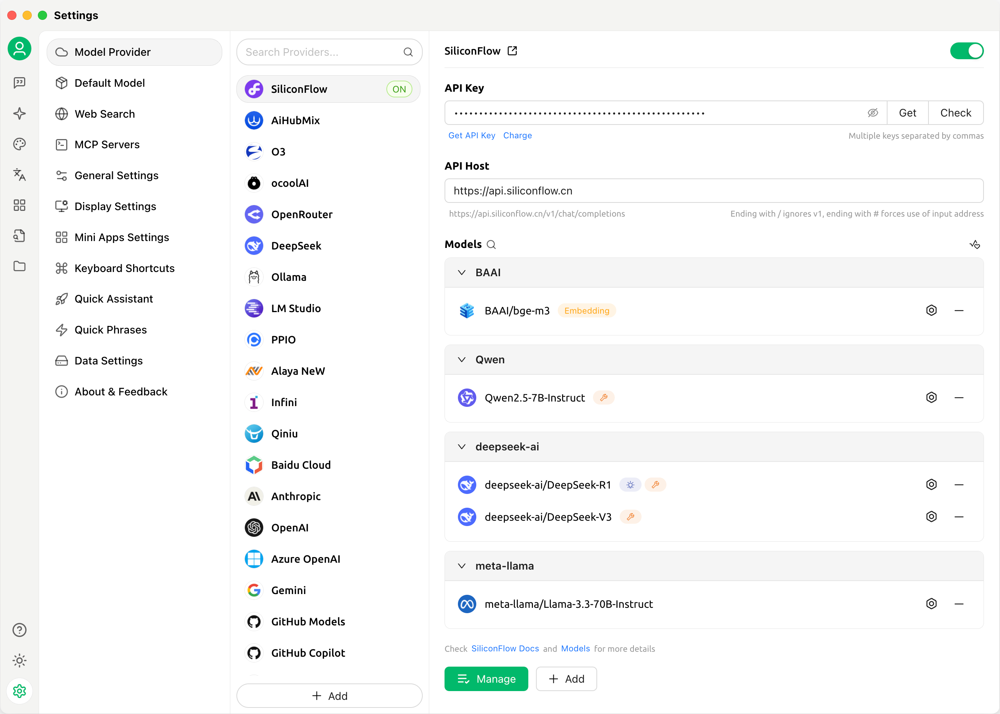

# Trending AI Open Source Projects: A Developer's Guide to the Latest Innovations

## Why These Projects Matter

As an AI practitioner, I've been closely following the rapid evolution of open source AI tools and frameworks. The landscape has exploded with innovative projects that are fundamentally changing how we build, deploy, and scale AI applications. What's particularly striking about the current AI open source ecosystem is how it's become a data-driven, community-first endeavor where organizations are building panoramic views of the ecosystem and sharing both insights and raw data back to the community.

The ecosystem is remarkably young yet massive: the median project age is about 30 months, with 62% of projects launched after the "GPT moment" in October 2022, and several just this year. These projects average nearly 30,000 stars, showing incredible community engagement. Participation is truly global - over 366,000 developers have engaged, with contributors primarily located in the United States and China, with the US leading at 37.4% and China at 18.7%, followed by Germany, India, and the UK. Interestingly, Chinese developers invest relatively more in the Agent layer.

Across more than 170 tracked projects, the most active communities span the full model lifecycle: compute and frameworks (PyTorch, Ray), data pipelines (Airflow), serving and performance (vLLM, SGLang, TensorRT-LLM), agent orchestration (Dify, n8n), and developer-facing tools (Gemini CLI, Cherry Studio). Language-wise, Python dominates infrastructure while TypeScript rules the application layer, and high-impact academic labs and major vendors co-exist with fast-moving independent teams - signs of a robust, multi-origin innovation engine.

These aren't just academic experiments or proof-of-concepts - these are production-ready tools that are already being adopted by major companies and reshaping entire workflows. From hardware abstraction layers that eliminate vendor lock-in to multi-agent orchestration platforms that handle complex workflows, these projects represent the cutting edge of what's possible in AI development today.

What makes these projects particularly noteworthy is how they address real-world pain points that every AI developer faces: fragmented tooling, deployment complexity, performance optimization, and the constant challenge of keeping up with rapidly evolving model capabilities. Each project in this list offers a unique solution to these challenges, and together, they're creating a more cohesive and powerful AI development ecosystem.

(From: https://antoss-landscape.my.canva.site/)

## 1. Modular (MAX Platform)

**GitHub Repository:** [https://github.com/modular/modular](https://github.com/modular/modular)

The Modular Platform represents a revolutionary approach to AI development and deployment, seamlessly integrating MAX (model serving) and Mojo (a high-performance language) to abstract hardware complexity and enable teams to run popular open models with industry-leading GPU and CPU performance without requiring code changes.

This innovative platform tackles the persistent challenges of hardware heterogeneity and performance portability by providing vendor-agnostic containers for NVIDIA, AMD, and unified options, dramatically simplifying deployment across diverse environments. The platform's comprehensive architecture includes an OpenAI-compatible inference server with REST API capabilities, extensive GPU/CPU kernels written in Mojo, and Python-based model pipelines that serve as production-grade building blocks for extending new algorithms and hardware targets. With over 450,000 lines of code from 6,000+ contributors, Modular has established itself as the world's largest open-source CPU/GPU kernel repository, offering Kubernetes-compatible Docker containers, reproducible distribution via pip/conda, and a robust governance model under Apache 2.0 licensing. The platform's impact on the AI industry is profound, lowering the cost and risk of adopting GenAI in production through standardized serving interfaces, reducing vendor lock-in through cross-vendor deployment support, and providing production-grade building blocks that elevate community benchmarks for performance, reliability, and extensibility. The strong community traction with tens of thousands of stars and hundreds of contributors demonstrates the platform's influence on best practices for performant, hardware-agnostic AI serving.

## 2. Agno

**GitHub Repository:** [https://github.com/agno-agi/agno](https://github.com/agno-agi/agno)

Agno addresses the complex technical and engineering challenges of building, operating, and scaling secure multi-agent systems in production environments through its innovative AgentOS architecture that enables privacy-preserving deployment in private clouds with day-one operability via a pre-built FastAPI application and full visibility through a browser-based control plane without external data retention.

The platform's high-performance runtime is engineered for agentic scale, achieving remarkable agent instantiation times of approximately 3 microseconds with memory footprints around 6.5 KiB on Apple M4 MacBook Pro systems, emphasizing minimal overhead and parallelized tool calls for large multi-agent workflows. Agno's comprehensive agent framework features include sophisticated session management, memory systems, knowledge integration, human-in-the-loop capabilities, and MCP support, enabling the composition of autonomous multi-agent teams or step-based workflows for precise control over complex processes. The platform's developer experience focus includes quickstart guides, examples galleries, llms.txt for LLM/assistant documentation parsing, and seamless IDE integration with tools like Cursor, while maintaining operational rigor through reproducible performance evaluations, GitHub Actions integration, and opt-out telemetry for privacy-conscious deployments. Agno's contribution to the AI industry is significant, helping enterprises and startups transition from prototypes to reliable, secure, and monitorable agent systems while advancing the performance frontier for agent frameworks and promoting responsible AI operations through privacy, observability, and human-in-the-loop practices that are increasingly required in regulated sectors. The platform's visible ecosystem traction with 33.8k stars, 4.3k forks, and 300+ contributors reinforces its role as a reference runtime for agentic systems.

## 3. ms-swift

**GitHub Repository:** [https://github.com/modelscope/ms-swift](https://github.com/modelscope/ms-swift)

ms-swift stands as a scalable, lightweight infrastructure that unifies the entire AI model lifecycle from training through inference, evaluation, quantization, and deployment for over 500 text LLMs and 200 multimodal LLMs spanning images, video, and audio, providing a single comprehensive pipeline from research to production with acceleration backends and a zero-threshold Web UI that has earned acceptance by AAAI 2025, reflecting both technical maturity and significant community impact.

The platform addresses the critical problem of tooling fragmentation across models and modalities by offering a unified CLI and Python API for the complete training -> inference -> evaluation -> quantization -> deployment workflow, supporting both ModelScope and HuggingFace downloads while exposing an OpenAI API layer and providing extensive plugin/extension hooks for custom models, datasets, losses, metrics, trainers, callbacks, and optimizers. ms-swift tackles cost and efficiency constraints in fine-tuning and serving through comprehensive integration of lightweight adaptation techniques including LoRA, QLoRA, DoRA, LoRA+, ReFT, GaLore, Q-GaLore, LISA, UnSloth, and Liger, alongside export/training quantization methods like AWQ, GPTQ, BNB, FP8, AQLM, HQQ, and EETQ, and inference acceleration through vLLM, SGLang, and LMDeploy backends. The platform's technical characteristics encompass an impressive breadth of model and task coverage supporting major LLMs like Qwen3, Llama4, InternLM3, GLM4.5, and DeepSeek-R1, along with 200+ multimodal models including Qwen-VL, LLaVA, InternVL, MiniCPM-V, GLM4v, Phi-Vision, and GOT-OCR2, spanning VQA, captioning, OCR, and grounding tasks. ms-swift's distributed and long-context capabilities support CPU, consumer and data-center GPUs, Ascend NPU, and Apple MPS through multiple parallelism strategies including DDP, DeepSpeed ZeRO2/3, FSDP, Megatron, and sequence parallel processing, while providing end-to-end RLHF and alignment capabilities through DPO, GRPO, PPO, RM, KTO, CPO, SimPO, and ORPO for both text and multimodal applications. The platform's contribution to the AI industry is substantial, providing a unified development pipeline that reduces fragmentation and accelerates development cycles while demonstrating up to 300% GRPO training speedups through engineering optimizations, supporting diverse hardware configurations to make AI development accessible across different infrastructure setups, and bridging the gap between research experimentation and production deployment with standardized tools and workflows.

## 4. Mastra

**GitHub Repository:** [https://github.com/mastra-ai/mastra](https://github.com/mastra-ai/mastra)

Mastra emerges as a sophisticated TypeScript framework for building production-grade AI agents and assistants, designed for large enterprises and deployable across local environments, Node.js servers with Hono, or serverless cloud platforms, aiming to unify LLM access, orchestrate complex agent workflows, and provide comprehensive observability, integrations, and evaluation tooling out of the box.

The framework addresses the critical challenge of provider fragmentation and model routing by providing a single interface over OpenAI, Anthropic, Gemini, and other major providers with flexible model selection and streaming capabilities, reducing provider lock-in and integration boilerplate while enabling cost and performance optimization through multi-provider support. Mastra's technical architecture emphasizes type safety with 99% TypeScript codebase, featuring schema-defined, parameter-validated, type-safe functions for tool calling with built-in access to configured integrations, durable graph-based workflows with loops, branching, human input waiting, and embedding workflows, plus comprehensive error handling and retry mechanisms that transform fragile prompts into dependable automations. The platform's observability capabilities include OpenTelemetry tracing for every workflow step, providing teams with end-to-end visibility and easier debugging in production environments, while its knowledge integration features offer end-to-end ETL for chunking, embedding, and vector search to build retrievers and knowledge bases for agents, reducing the need for bespoke data plumbing. Mastra's third-party system connectivity is enhanced through auto-generated, type-safe API clients that can be invoked as tools or workflow steps, minimizing integration drift and schema mismatch, while its quality assurance framework includes model-graded, rule-based, and statistical evaluations producing normalized 0-1 scores with customizable prompts and scoring for continuous evaluation in CI/CD pipelines. The framework's contribution to the AI industry is significant, standardizing the agent stack from LLM routing through tools, workflows, RAG, integrations, evaluations, and observability, reducing bespoke glue code and accelerating time-to-production for AI automation and customer-facing agents while elevating LLMOps best practices and mitigating vendor lock-in through multi-provider support and easy routing. Mastra's strong open-source traction with 16.8k stars, 1.1k forks, and 229 contributors demonstrates growing ecosystem impact and industrial adoption, while its embrace of emerging standards like MCP in mainstream IDEs lowers integration costs and improves the feedback loop between developers and AI tooling.

## 5. Langflow

**GitHub Repository:** [https://github.com/langflow-ai/langflow](https://github.com/langflow-ai/langflow)

Langflow represents a pioneering visual framework for building AI agents and workflows, combining an intuitive visual builder with built-in API and MCP servers that enable any flow to be transformed into a tool and integrated across technology stacks without requiring bespoke glue code, fundamentally addressing the complexity of multi-agent orchestration through sophisticated conversation management and retrieval capabilities that tackle coordination, memory, and context handling for complex agent systems.

The platform's visual builder interface enables rapid authoring with source-code access for customizing components in Python, while its built-in API and MCP servers expose flows as tools with JSON export capabilities and comprehensive support for major LLMs and vector databases, creating a "batteries included" approach that mitigates ecosystem fragmentation and reduces boilerplate code. Langflow's interactive playground supports immediate, step-by-step testing and iteration, significantly reducing prototyping friction, while its observability integrations with LangSmith, LangFuse, and other platforms provide enterprise-ready scalability and security features that improve troubleshooting and system monitoring. The platform's deployment capabilities span APIs, MCP servers, and Docker/cloud workflows with support for JSON export to Python applications, meeting diverse operational needs while maintaining a proactive security posture through enterprise-ready features, timely CVE advisories, and security patches. Langflow's technical characteristics include cross-environment deployment support with open-source availability, Docker guides, major cloud platform integration, and quickstart capabilities via uv for Python 3.10-3.13, while its active engineering practices encompass comprehensive CI/test coverage, template tests, frontend build options, Docker/Podman updates, feature flags, voice mode, and component upgrades. The platform's mature ecosystem and codebase, evidenced by 122k stars, 7.7k forks, 263 releases, and 500+ deployments with a polyglot stack including Python (~49.7%) and TypeScript/JavaScript, demonstrates broad community traction and real-world impact. Langflow's contribution to the AI industry is substantial, lowering the barrier from experimentation to production by providing an end-to-end path for designing, testing, observing, and deploying agents and workflows, accelerating product cycles and reducing integration costs while advancing interoperability through MCP standardization and improving reliability and governance through observability and proactive security measures that are critical for enterprise AI adoption.

## 6. Gemini CLI

**GitHub Repository:** [https://github.com/google-gemini/gemini-cli](https://github.com/google-gemini/gemini-cli)

Gemini CLI revolutionizes developer productivity by placing a capable, multimodal Gemini agent directly in the terminal, enabling developers to query, generate, and edit code without the friction of context switching between IDEs, browsers, and separate tools, while handling large-context reasoning challenges through Gemini 2.5 Pro's impressive 1M-token window combined with project-scoped context via GEMINI.md files, conversation checkpointing, and token caching that addresses the engineering complexities of long-running sessions, reproducibility, and efficient token utilization.

The platform's technical architecture supports multimodal code understanding and generation across large codebases, capable of bootstrapping applications from PDFs, images, and sketches while supporting debugging through natural language interactions, with built-in tools including Google Search grounding, file operations, shell commands, and web fetch capabilities that enable multi-file operations for comprehensive codebase-wide actions. Gemini CLI's extensibility through MCP (Model Context Protocol) enables custom integrations including media generation through Imagen, Veo, and Lyria, while supporting custom commands and tools development, with scriptability features including non-interactive mode with structured JSON output that enables robust automation and error handling in CI/CD and operational pipelines. The platform's memory and efficiency features include GEMINI.md context files, checkpointing, and token caching for reproducible and efficient long sessions, while its enterprise-readiness encompasses Vertex AI support, sandboxing and security guidance, enterprise deployment patterns, and comprehensive telemetry and monitoring capabilities. Gemini CLI's developer ecosystem integration includes GitHub Actions for automated PR reviews and issue triage, VS Code companion integration, and accessibility features through open-source Apache-2.0 licensing with free tiers that lower the barrier to entry. The platform's contribution to the AI industry is significant, establishing a high-quality, open-source reference for terminal-first AI agents that are scriptable and tool-augmented, accelerating best practices for agentic workflows in software engineering while promoting interoperability through MCP and encouraging a more modular ecosystem where agents can safely access enterprise systems and third-party tools. Gemini CLI demonstrates operational patterns including structured JSON I/O, release channels, sandboxing, and enterprise authentication that teams can adopt for production-grade AI automation in CI/CD and DevOps environments, while encouraging large-context, multimodal development workflows that push the practical boundaries of LLM use in real-world engineering tasks through 1M-token reasoning over entire repositories encompassing code, documentation, and images.

## 7. Supabase AI & Vector Toolkit

**GitHub Repository:** [https://github.com/supabase/supabase](https://github.com/supabase/supabase)

Supabase's AI & Vector toolkit represents a groundbreaking solution to core engineering problems in building AI-enabled applications by unifying vector embeddings with transactional data within Postgres, providing first-class indexing and search capabilities through pgvector, and offering turnkey integrations with leading AI providers- all without requiring separate infrastructure or complex ETL processes.

The platform addresses the critical challenge of unified storage and querying by enabling the storage, indexing, and querying of embeddings alongside relational data in a single Postgres instance, facilitating hybrid SQL and vector similarity queries with real-time updates without maintaining separate vector database infrastructure. Supabase's efficient similarity search capabilities at scale leverage native vector types, HNSW/IVFFlat indexes, and operators for cosine and IP distance calculations, providing comprehensive guidance on filtered and iterative searches for exact result counts, while its seamless AI integration features include managed connectivity to OpenAI, Hugging Face, Amazon Bedrock, LangChain, and LlamaIndex with embedding generation capabilities that can run directly in Edge Functions. The platform's production operations encompass compute add-ons, connection pooling through Supavisor, multi-region deployments, automatic backups with point-in-time recovery, SOC2 compliance, and self-hosting options, while its developer velocity features include auto-generated REST/GraphQL APIs, extensive client libraries, examples and templates for JavaScript, Python, and Next.js, and a Python Vecs client for unstructured embeddings. Supabase's technical characteristics are built on a Postgres + pgvector foundation with vector columns and advanced indexes, embodying the philosophy that "the best vector database is the database you already have," while providing real-time features including broadcast, presence, Postgres changes, Edge Functions powered by Deno, S3-compatible Storage, and built-in Auth with Row Level Security for fine-grained access control. The platform's AI Integrations feature provides plug-and-play model access with semantic, keyword, and hybrid search guides and production RAG with permissions best practices, while its MCP Server enables AI tools and IDEs to connect to Supabase for model-context aware operations over backend systems. Supabase's contribution to the AI industry is substantial, lowering barriers to AI app development by making embeddings and search first-class in mainstream Postgres, democratizing access beyond specialized vector databases and reducing vendor lock-in through open-source tooling and portability, with proven adoption demonstrated by Mozilla MDN, Quivr, and Firecrawl citing scalability, performance, and simpler metadata management, while Chatbase achieved remarkable growth from concept to $1M ARR in just 5 months using Supabase. The platform's broad ecosystem validation includes OpenAI's cookbook demonstrating semantic search on Supabase Vector, while Supabase integrates with leading AI builders like Vercel's v0 to accelerate the "build in a weekend, scale to millions" paradigm, with Series D funding led by Accel highlighting Supabase as a standard backend for AI-driven applications, serving millions of developers and enabling rapid database launches that fuel community and platform maturity.

## 8. Goose

**GitHub Repository:** [https://github.com/block/goose](https://github.com/block/goose)

Goose represents a comprehensive open-source, on-machine AI agent that automates complex software engineering tasks end-to-end, encompassing project building, code writing and execution, debugging, workflow orchestration, and autonomous interaction with external APIs, designed as an LLM-agnostic platform that supports multi-model configurations for performance and cost optimization while integrating with MCP servers and being available as both desktop application and CLI interfaces.

The platform addresses the critical challenge of end-to-end automation of development workflows beyond simple code suggestions, including project scaffolding, execution, debugging, workflow orchestration, and API integration, significantly reducing human-in-the-loop friction for routine engineering tasks while providing interoperability and cost/performance tuning through support for any LLM and multi-model setups that enable users to choose models per task and budget constraints. Goose's reliable local and CI/CD deployment capabilities include Docker support for pipelines, Nix flakes for reproducible builds, cross-platform build tooling for Windows and Linux, devcontainer fixes for protoc, and hermit-based toolchain provisioning, addressing consistency, portability, and build determinism across diverse environments while providing extensibility and standardization through Agent Client Protocol (ACP) implementation, MCP server integration, and a recipe system with inline Python that makes it easier to plug in tools and extend agent capabilities. The platform's robust developer UX and maintainability features include fuzzy file search, GUI initialization fixes, Chrome/VS Code extension tutorials, optimization for reading large files, and handling cancellation messages that improve responsiveness and developer workflows, while its governance and security measures encompass official security policies, acceptable use policies, and PR-level security scans that support safer open-source adoption in enterprise settings. Goose's technical characteristics include LLM-agnostic, multi-model orchestration with MCP integration, desktop and CLI form factors for flexible local use, comprehensive deployment and reproducibility tooling including Docker, Nix flakes, devcontainer, Windows and Linux build support, Termux-based Linux control on Android, and scripted installers that cover diverse developer environments and CI needs. The platform's protocol-level foundations include ACP implementation for agent-client interactions and MCP servers for tool interoperability, while its language stack is predominantly Rust (59.8%) and TypeScript (33.1%), suggesting a performance-focused core with a modern tooling/UI layer. Goose's active and mature project signals include v1.8.0 release, 19.8k stars, 1.7k forks, 274 contributors, and 500+ deployments, indicating broad community validation and sustained development velocity. The platform's contribution to the AI industry is significant, providing a practical, open-source agentic framework that is local-first, reproducible, and secure, lowering the barrier for organizations to adopt agent automation without vendor lock-in while enabling integration with existing toolchains through MCP and ACP protocols. Goose demonstrates viable patterns for multi-model orchestration and workflow-level autonomy, advancing the state of agent engineering beyond IDE autocomplete toward reliable execution and debugging pipelines, while its community scale and tooling breadth in CI/CD, build systems, and protocols help standardize best practices for agent deployment in production-like environments.

## 9. Cherry Studio

**GitHub Repository:** [https://github.com/CherryHQ/cherry-studio](https://github.com/CherryHQ/cherry-studio)

Cherry Studio emerges as a unified multi-LLM access desktop client that seamlessly integrates major cloud LLMs including OpenAI, Gemini, and Anthropic, AI web services like Claude, Perplexity, and Poe, and local models such as Ollama and LM Studio, while supporting multi-model simultaneous conversations that dramatically reduce API fragmentation and switching overhead for developers and organizations.

The platform addresses the critical challenge of unified multi-LLM access and consistent user experience through a single desktop client that eliminates the need for multiple interfaces and reduces context switching, while providing cross-platform distribution with ready-to-use builds for Windows, Mac, and Linux that minimize environment configuration and accelerate adoption across teams. Cherry Studio's integrated document and data workflow capabilities include in-chat handling of text, images, Office documents, and PDFs, WebDAV-backed file management and backup systems, Mermaid visualization, and code syntax highlighting that unify content and tooling in a single interface, while its tool and context protocol interconnection features include built-in MCP (Model Context Protocol) Server and a planned MCP Marketplace for standardized, pluggable tool-model connectivity. The platform's enterprise governance and compliance features encompass Enterprise Edition capabilities that centralize model management, shared knowledge bases, fine-grained access control, fully private deployment, and reliable backend services to meet organizational security and compliance needs, while its UI/theme ecosystem includes a community-driven theme gallery and multiple themes that facilitate customization and developer productivity, strengthening the client's extensibility and user experience. Cherry Studio's technical characteristics include diverse LLM provider support with 300+ pre-configured assistants, custom assistant creation capabilities, and parallel multi-model conversations for rapid task-oriented orchestration, while its practical productivity tools encompass global search, topic management, AI translation, drag-and-drop sorting, Mini Programs, complete Markdown rendering, and easy content sharing. The platform's cross-platform, ready-to-use experience includes light/dark and transparent windows that ensure broad accessibility and smooth onboarding, while its roadmap for continued evolution includes Selection Assistant, Deep Research, global Memory System, Document Preprocessing, MCP Marketplace, knowledge management through Notes, Collections, Dynamic Canvas, OCR, and TTS capabilities, platform expansions to HarmonyOS PC, Android/iOS, multi-window, and window pinning, and advanced features including Plugin System, ASR, and interaction refactoring. Cherry Studio's enterprise capabilities include centralized model access, employee management, shared knowledge base, role-based permissions, private deployment, backups, and reliable APIs. The platform's contribution to the AI industry is substantial, lowering integration and migration costs by unifying cloud, web, and local models in a single client while offering enterprise out-of-the-box governance that reduces the need for custom gateways and per-user configuration, improving rollout speed in organizations. Cherry Studio's standardization and interoperability features through MCP Server and the upcoming MCP Marketplace promote modular tool-model connections and ecosystem compatibility across workflows, while its open-source momentum and community co-creation include a structured contributor program with incentives, sustained releases, broad participation evidenced by 33.4k stars, 3k forks, 282 contributors, and 207 releases, and active discussions that drive rapid iteration and best-practice sharing. The platform's enterprise adoption and compliance capabilities align with enterprise security, compliance, and business continuity requirements through fully private deployment, unified governance, and fine-grained permissions.

## Final Thoughts

After diving deep into these nine projects, I'm genuinely excited about the direction the AI open source ecosystem is heading. What strikes me most is how these tools are solving problems that I've personally struggled with in my own AI development work.

The modularity and interoperability between these projects is particularly impressive. You can start with Modular for hardware abstraction, use ms-swift for your training pipeline, deploy with Mastra's agent framework, and monitor everything through Langflow's visual interface. It's like having a complete AI development stack that actually works together.

What I find most encouraging is that these aren't just tools for AI researchers or big tech companies - they're designed for real developers building real applications. The documentation is solid, the communities are active, and the projects are being battle-tested in production environments.

If you're working in AI development, I'd strongly recommend exploring at least a few of these projects. The learning curve is worth it, and you'll likely find solutions to problems you didn't even know you had. The AI tooling landscape is evolving rapidly, and these projects are leading the charge toward a more mature, production-ready ecosystem.

Which of these projects have you tried? I'd love to hear about your experiences and any other trending AI open source projects I might have missed.
